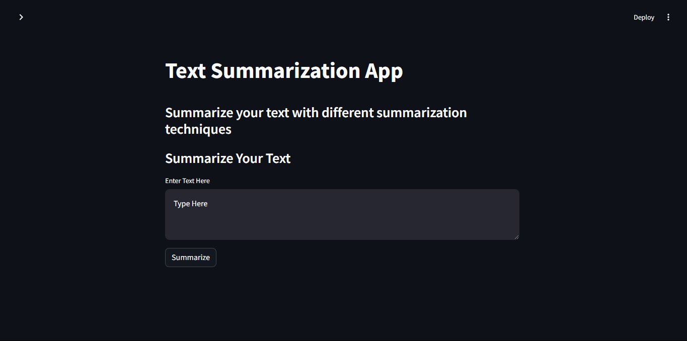

# Text Summarization App

This is a Streamlit-based web application for text summarization using various summarization techniques such as SpaCy, Sumy, NLTK, and T5. i have also added notebooks for doing the same tasks that is implementing a text summarization engine using pegasus, gensim and bert. check for the notebook [here]()

## Table of Contents

- [Introduction](#introduction)
- [Features](#features)
- [Installation](#installation)
- [Usage](#usage)
- [Technologies Used](#technologies-used)
- [Images](#images)
- [Contributing](#contributing)
- [License](#license)

## Introduction

The goal of this project is to offer an intuitive user interface for various algorithmic text summarization techniques. Users can either enter text directly into the app or supply a URL for the program to pull content from for summarizing. To accommodate a variety of tastes and requirements, the application offers a number of summarizing techniques.

## Features

- **Text Summarization:** Summarize text using SpaCy, Sumy, NLTK, and T5 models.
- **URL Summarization:** Extract and summarize text from a provided URL.
- **Reading Time Calculation:** Estimate the reading time of the original text.
- **Responsive Interface:** Simple and intuitive user interface using Streamlit.
- **Minimalist Design:** Clean and elegant frontend design for better user experience.

## Installation

To run this application locally, follow these steps:

1. Clone the repository:

   ```bash
   git clone <repository-url>
   cd text-summarization-app
   ```

2. Create a virtual environment (optional but recommended):

   ```bash
   python -m venv myenv
   source myenv/bin/activate  # On Windows use `myenv\Scripts\activate`
   ```

3. Install the required dependencies:

   ```bash
   pip install -r requirements.txt
   ```

## Usage

To start the application, run the following command:

```bash
streamlit run streamlit_app.py
```

This command will launch a local server on the 8501 port which one can open in their default web browser. they can then interact with the app by selecting different summarization options and providing input text or URLs for summarization.

## Technologies Used

- **Python:** Programming language used for backend development.
- **Streamlit:** Web application framework for building interactive web applications.
- **SpaCy:** Natural language processing library used for text processing and summarization.
- **NLTK:** Natural language toolkit library for various NLP tasks including text summarization.
- **Sumy:** Library for automatic text summarization.
- **T5 Model:** Pre-trained text-to-text transformer model by Google Research for text summarization.

## Images

- **Homepage:**
  

- **Homepage with Toggle:**
  

- **URL Summarization with Toggle:**
  

Include actual paths and filenames for your images (`homepage.png`, `homepage_toggle.png`, `url_summarization_toggle.png`, etc.) and ensure they are placed in a directory named `images` within your project structure.

## Contributing

Contributions are welcome! If you have any suggestions, improvements, or feature requests, please open an issue or submit a pull request.

## License

This project is licensed under the MIT License - see the [LICENSE](LICENSE) file for details.
